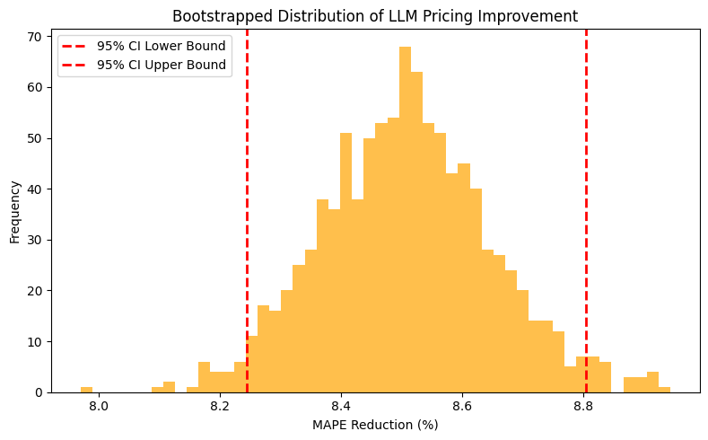

# 📦 Offline Evaluation Labs: Foundation Models in Pricing

*Applying statistical rigor to evaluate LLM-driven price estimation at scale.*

## The Context
As we deploy Generative AI and multi-agent systems to estimate competitive product prices, we must move beyond basic accuracy metrics. We need rigorous offline labs to ensure that model variants actually improve customer price perception without introducing hallucinatory edge cases that impact downstream supply chain financials.

## The Experiment Design
This repository simulates an offline evaluation pipeline comparing a baseline Foundation Model against an Agentic LLM for price estimation. 

* **The Challenge:** LLMs are prone to structural recurrence of errors. A simple average error metric masks tail-end hallucinations.
* **The Methodology:** I implemented **Statistical Bootstrapping** to construct 95% confidence intervals around the Mean Absolute Percentage Error (MAPE) reduction.

### 📊 Statistical Confidence in Model Rollouts
The histogram below proves that Model B provides a statistically significant reduction in pricing error. The lower bound of the 95% CI sits firmly above zero, giving stakeholders the mathematical confidence required for a production launch.

\
